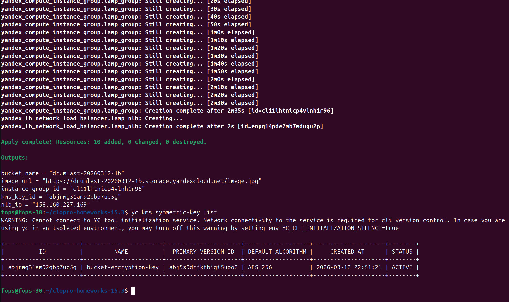
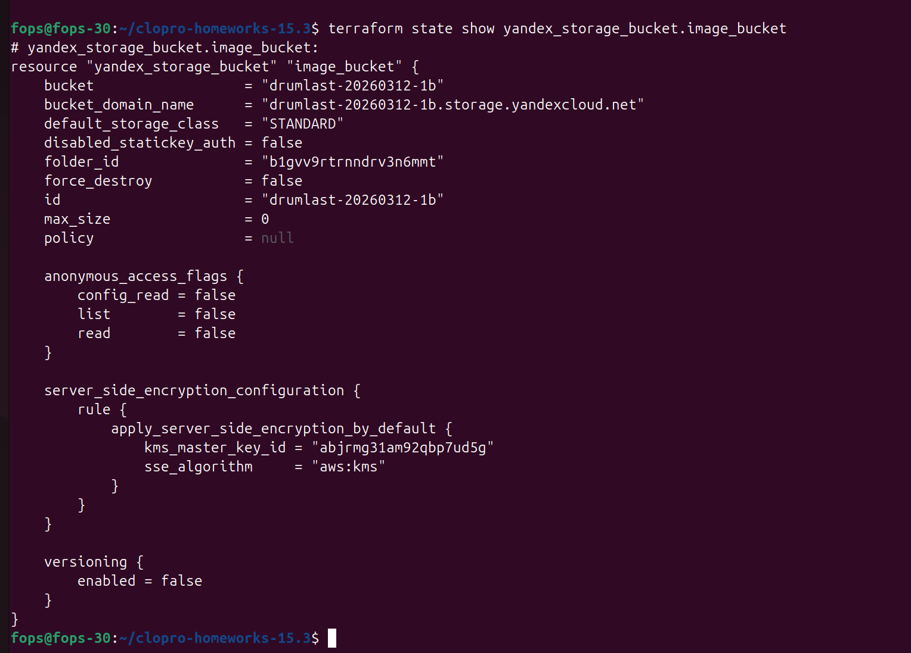
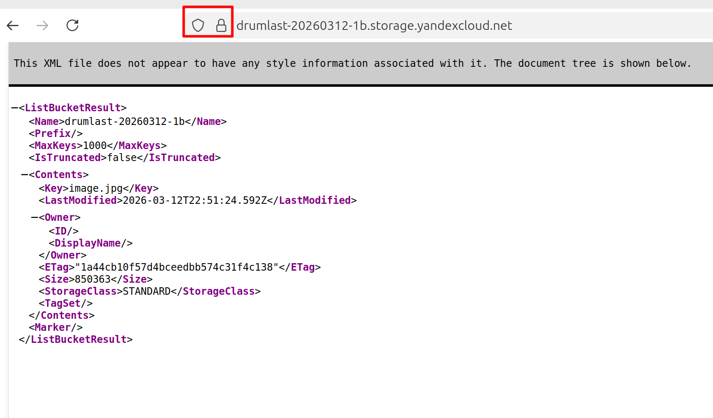
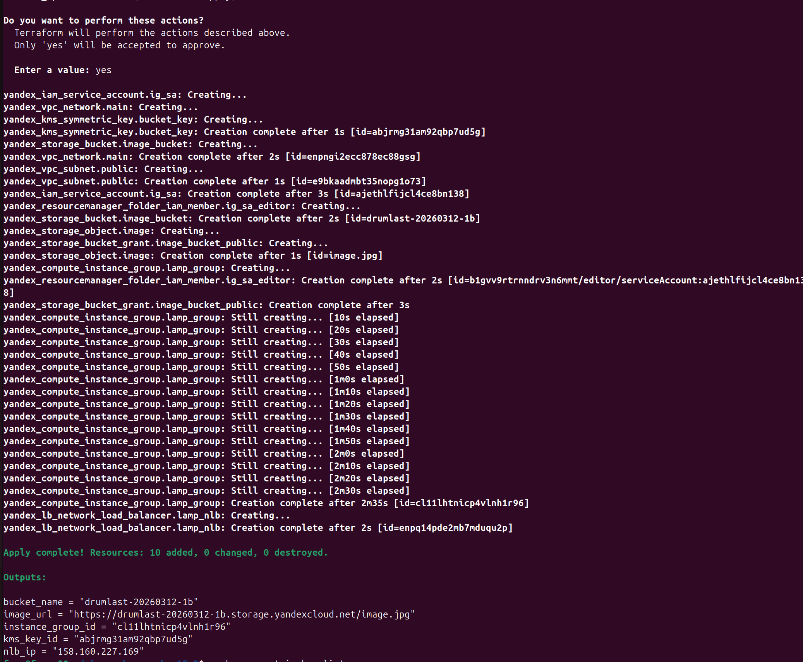
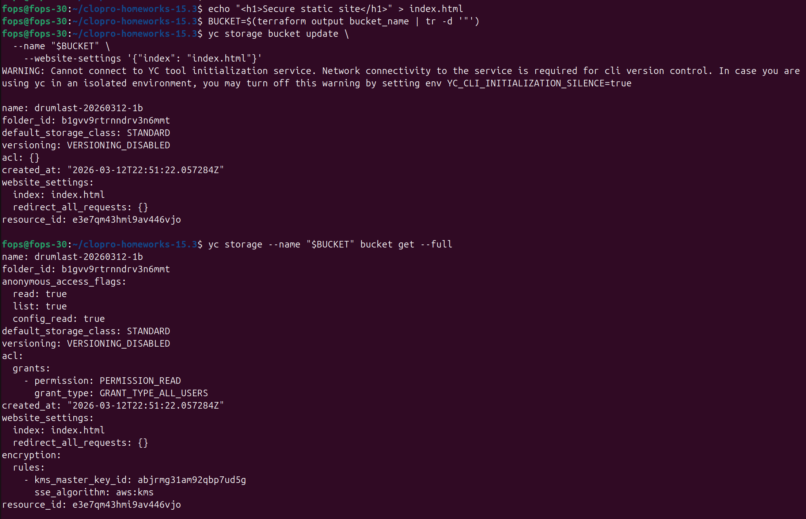
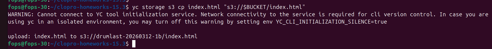

# Домашнее задание: «Безопасность в облачных провайдерах»

## Цель
Добавить **шифрование бакета Object Storage** с помощью **Yandex KMS** на основе инфраструктуры из предыдущих заданий.

Дополнительно:
- создать **статический сайт в Object Storage**
- включить **HTTPS через сертификат**

---

# Используемые технологии

- Terraform
- Yandex Cloud
- KMS
- Object Storage
- TLS сертификаты

---

# Структура Terraform

```text
providers.tf
variables.tf
network.tf
storage.tf
kms.tf
ig.tf
nlb.tf
outputs.tf
personal.auto.tfvars
```

---

# 1. Создание ключа шифрования KMS

## `kms.tf`

```hcl
resource "yandex_kms_symmetric_key" "bucket_key" {
  name              = "bucket-encryption-key"
  description       = "KMS key for Object Storage encryption"
  default_algorithm = "AES_256"
  rotation_period   = "8760h"
}
```

Проверка:

```bash
yc kms symmetric-key list
```

Скриншот:



---

# 2. Шифрование бакета Object Storage

Обновляем `storage.tf`.

```hcl
resource "yandex_storage_bucket" "image_bucket" {
  bucket    = var.bucket_name
  folder_id = var.folder_id

  server_side_encryption_configuration {
    rule {
      apply_server_side_encryption_by_default {
        kms_master_key_id = yandex_kms_symmetric_key.bucket_key.id
        sse_algorithm     = "aws:kms"
      }
    }
  }
}
```

Публичный доступ к бакету:

```hcl
resource "yandex_storage_bucket_grant" "image_bucket_public" {
  bucket = yandex_storage_bucket.image_bucket.bucket

  grant {
    type        = "Group"
    permissions = ["READ"]
    uri         = "http://acs.amazonaws.com/groups/global/AllUsers"
  }
}
```

Загрузка изображения:

```hcl
resource "yandex_storage_object" "image" {
  bucket = yandex_storage_bucket.image_bucket.bucket
  key    = var.image_file_name
  source = var.image_file_path
}
```

---

# 3. Проверка шифрования

```bash
terraform state show yandex_storage_bucket.image_bucket
```

В выводе должен присутствовать KMS ключ.

Скриншот:




---

# 4. Terraform команды

```bash
terraform init
terraform fmt
terraform validate
terraform plan
```

Скриншот:


```bash
terraform apply
```

Скриншот:



---

# 5. Создание статического сайта (вручную)

Это действие выполняется **не через Terraform**.

Создаем страницу:

```bash
echo "<h1>Secure static site</h1>" > index.html
```

## Включение static website

```bash
BUCKET=$(terraform output bucket_name | tr -d '"')
```

```bash
yc storage bucket update \
  --name "$BUCKET" \
  --website-settings '{"index": "index.html"}'
```

Проверяем:

```bash
yc storage --name "$BUCKET" bucket get --full
```


Загружаем:

```bash
yc storage s3 cp index.html "s3://$BUCKET/index.html"
```

Скриншот:




---

# 6. Настройка HTTPS

Создаем сертификат:

```bash
yc certificate-manager certificate create \
  --name bucket-cert \
  --domains "example.your-domain.ru"
```

После подтверждения домена сертификат можно применить к статическому сайту.

---

# 7. Проверка HTTPS

Открываем сайт:

```text
https://example.your-domain.ru
```

В браузере должен отображаться **замочек TLS**.

Скриншот:


---

# Результат

В результате выполнения задания:

- создан **KMS ключ**
- бакет Object Storage **шифруется через KMS**
- объекты в бакете автоматически шифруются
- развернут **статический сайт**
- сайт доступен **по HTTPS**

Это соответствует требованиям задания по безопасности облачной инфраструктуры.

